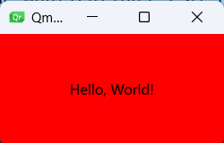

# First Step with QML

每个`QML`文件都包含两部分：一个`import`部分和一个对象声明部分。对用户界面来说，最常用的类型和函数都定义在`QtQuick` 这个模块里。

## 编写HelloWorld

先从编程世界起点`HelloWorld`开始，这里，我们先不建立`Qt Project`，从最简单的文本文件开始，避免复杂的项目结构带来的困惑。直接新建一个`HolloWorld.qml`文件，编写如下代码：

```
import QtQuick

Rectangle {
    width: 200
    height: 100
    color: "red"

    Text {
        anchors.centerIn: parent
        text: "Hello, World!"
    }
}
```

代码中，第一行`import QtQuick` 导入了`QtQuick`模块，这样，我们就可以用下面的`Rectangle`和`Text`等常用的界面组件了。

在上面的代码中，`Rectangle`部分，我们定义了一个宽200像素，高100像素的红色矩形框，同时，在矩形框中放置了一段`Hello, World!`文本，该段文本的中心，与矩形框的中心对齐，类似`excel`单元格的居中对齐。

## 运行HelloWorld

怎么运行这段代码，如果建立`Qt Project`直接将这段代码放进`Main.qml`中能运行吗？很不幸，不能，这样会崩溃。这里我们直接在命令行使用`qml`命令运行`HelloWorld.qml`文件就可以。

```sh
qml HelloWorld.qml
```

我们做好的界面长这样：



## 更进一步，处理用户输入

新建一个`ClickableHelloWorld.qml`，内容如下：

```
import QtQuick

Rectangle {
    width: 200
    height: 100
    color: "red"

    Text {
        anchors.centerIn: parent
        text: "Hello, World!"
    }

    TapHandler {
        onTapped: parent.color = "blue"
    }
}
```

同样用`qml`命令运行此文件，显示的还是上面的红色`HelloWorld`界面，用鼠标点击之后，界面编程蓝色的，如下图：


代码中，增加了`TapHandler`对象。`QML`中，将事件称为`signals`，将处理信号的对象称为`signal handlers`。点击时`tapped`信号会被发射，该信号被`onTapped`处理，处理结果是将父元素（也就是`Rectangle`对象）的颜色变为蓝色。这段代码在触屏设备也生效（触屏时间也会发射`tapped`信号）。

## 属性绑定

`QML`文件中，对象及他们的属性组成了最基本的图形界面，`QML`语言允许属性之间以多种方式相互绑定，先看下面的例子（`PropertyBindings.qml`）：

```
import QtQuick

Rectangle {
    width: 400
    height: 200

    Rectangle {
        width: parent.width / 2
        height: parent.height
        color: "blue"
    }

    Rectangle {
        width: parent.width / 2
        height: parent.height
        x: parent.width / 2
        color: "green"
    }
}
```

这个例子中，每个子矩形的长宽都与父矩形的长宽进行了对应的绑定，如果改变父矩形的尺寸，子矩形的尺寸也会自动跟着改变。类似下面这样：


## 动画

属性同样可以通过动画（animations）来动态地更新，看下面的例子（`Animations.qml`）

```
import QtQuick

Rectangle {
    color: "lightgray"
    width: 200
    height: 200

    property int animatedValue: 0
    SequentialAnimation on animatedValue {
        loops: Animation.Infinite
        PropertyAnimation { to: 150; duration: 1000 }
        PropertyAnimation { to: 0; duration: 1000 }
    }

    Text {
        anchors.centerIn: parent
        text: parent.animatedValue
    }
}

```

在这个示例中，我们用`property`定义了一个`animatedValue`的属性，属性初值为0，然后在使用`Animation on Property`语句指定将`SequentialAnimation`动画用于`animatedValue`属性，`SequentialAnimation`作用是顺序运行下面指定的两个`PropertyAnimation`动画，循环次数`loops`是`Animation.Infinite`无限循环，第一个`PropertyAnimation`动画，用`1000ms`的时间，将`animatedValue`变为150，第二个`PropertyAnimation`动画，用`1000ms`的时间，将`animatedValue`变为0。`Text`则将`animatedValue`显示出来。效果如下图：


## 用于重用的用户自定义QML类型

`QML`允许用户自定义类型，下面的例子（`MessageLabel.qml`）展示了一个自定义的`MessageLable`类型。

```
import QtQuick

Rectangle {
    height: 50
    property string message: "debug message"
    property var msgType: ["debug", "warning" , "critical"]
    color: "black"

    Column {
        anchors.fill: parent
        padding: 5.0
        spacing: 2
        Text {
            text: msgType.toString().toUpperCase() + ":"
            font.bold: msgType == "critical"
            font.family: "Terminal Regular"
            color: msgType === "warning" || msgType === "critical" ? "red" : "yellow"
            ColorAnimation on color {
                running: msgType == "critical"
                from: "red"
                to: "black"
                duration: 1000
                loops: msgType == "critical" ? Animation.Infinite : 1
            }
        }
        Text {
            text: message
            color: msgType === "warning" || msgType === "critical" ? "red" : "yellow"
            font.family: "Terminal Regular"
        }
    }

}
```

这个类型使用`Rectangle`作为父组件，定义了`message`和`msgType`两个属性，`Column`则将下面的两个`Text`对象放在同一列中展示，第一个`Text`对象用于展示`msgType`，将`msgType`转化为全大写并加上`:`，以`Terminal Regular`字体，显示`msgType`，如果`msgType`为`critical`还会加粗显示，同时，如果`msgType`为`critical`或`warning`，则用红色字体，否则用黄色字体，当`msgType`为`critical`时，还会对字体颜色`color`使用动画，在`1000ms`内，将字体颜色从红色变为黑色，并且无限循环进行。第二个`Text`对象则用对应颜色和字体显示`message`。

使用此类型的代码如下（`application.qml`）:

```
import QtQuick

Column {
    width: 180
    height: 180
    padding: 1.5
    topPadding: 10.0
    bottomPadding: 10.0
    spacing: 5

    MessageLabel{
        width: parent.width - 2
        msgType: "debug"
    }
    MessageLabel {
        width: parent.width - 2
        message: "This is a warning!"
        msgType: "warning"
    }
    MessageLabel {
        width: parent.width - 2
        message: "A critical warning!"
        msgType: "critical"
    }
}
```

运行`qml application.qml`，效果如下图：

