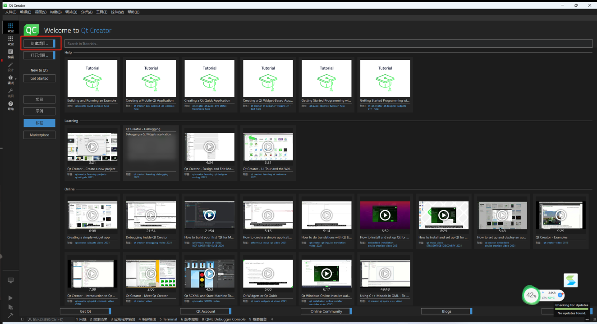
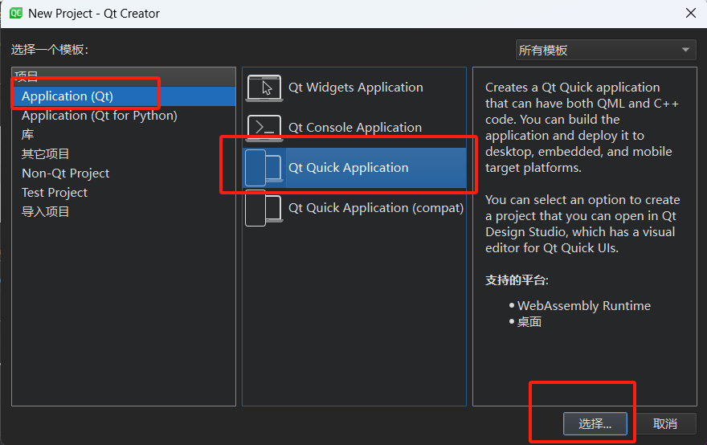
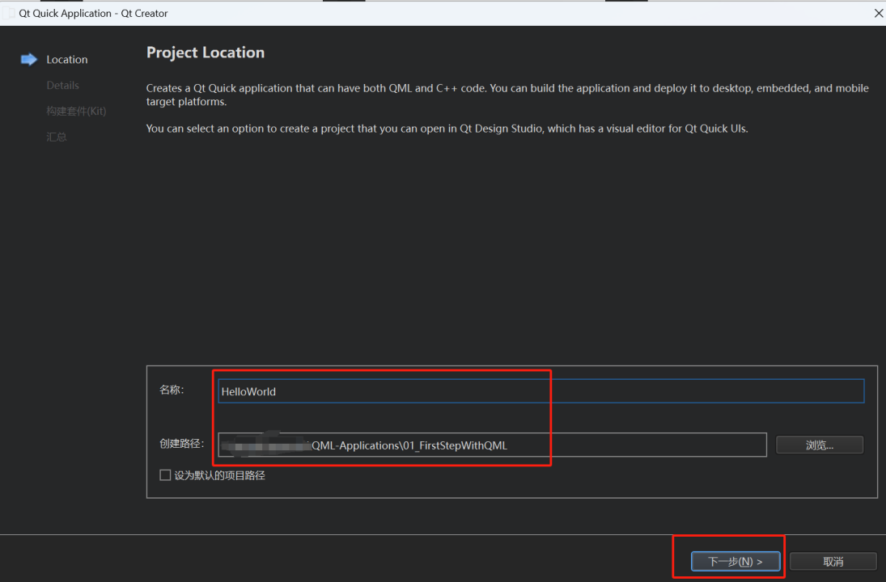
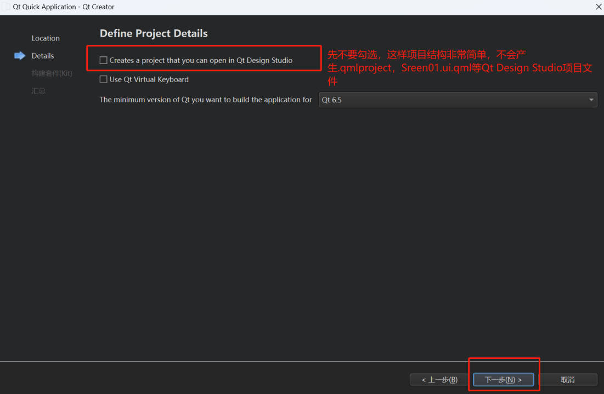
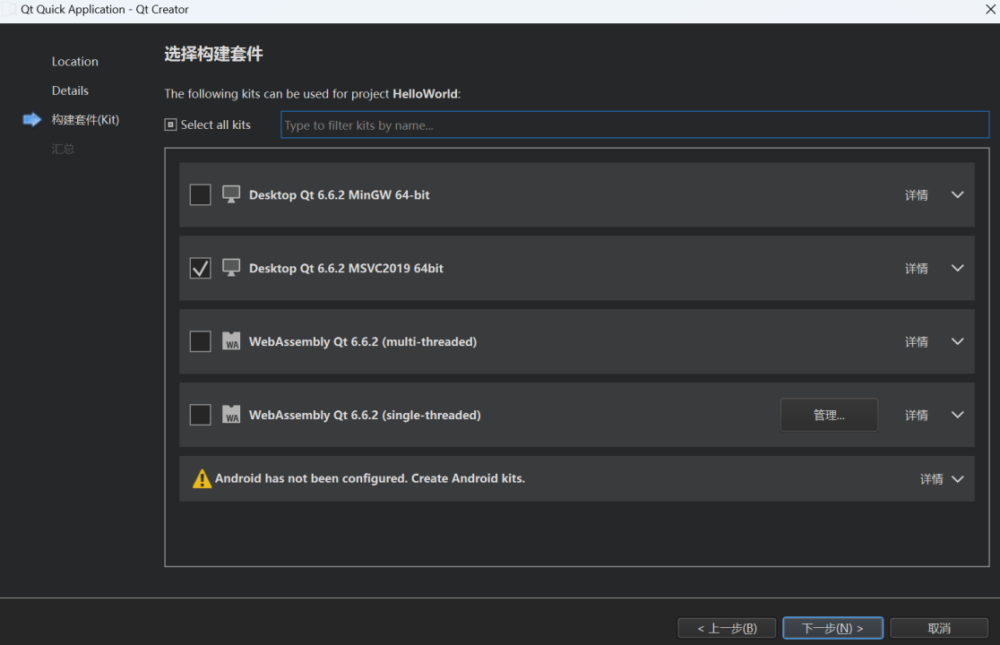
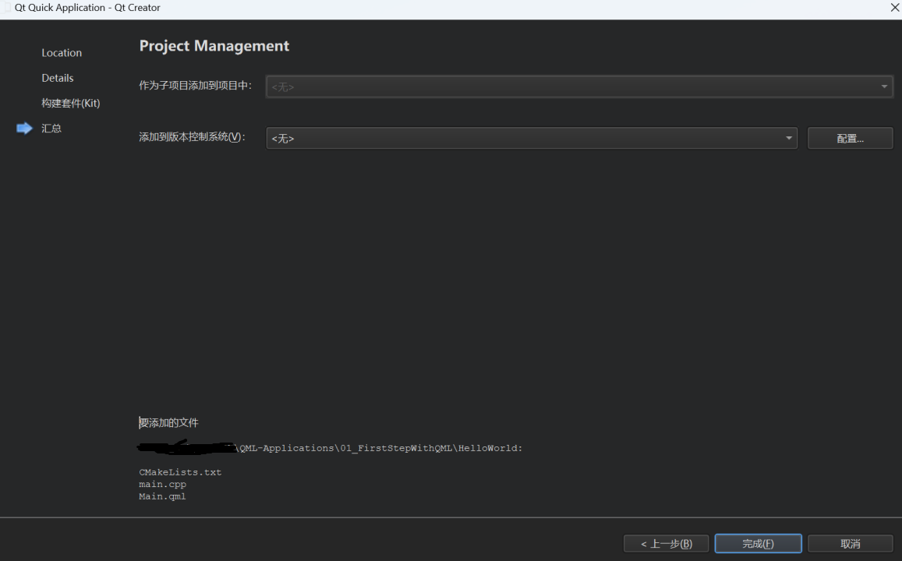

# 创建Qt Quick Projects

在创建Qt Quick项目之前，我们简单说一下Qml和Qt Quick的关系：它们的关系类似于C++和STL标准库的关系，Qml类比C++语言，提供了基本语言特性和类型；而Qt Quick则类比STL标准库，Qt Quick在QML的基础上加入了一系列界面可视化组件，方便开发者快速构建程序界面。

可以使用以下几种向导模板创建Qt Quick项目：

- **Application (Qt)** > **Qt Quick Application**
- **Application (Qt for Python)** > **Qt for Python - Qt Quick Application**
- **Other Project** > **Qt Quick UI Prototype**
- **Library** > **Qt Quick 2 Extension Plugin**

下面介绍**Qt Quick Application**和**Qt Quick UI Prototype**两种方式。

## Qt Quick Applications

按下图顺序一步一步即可创建**Qt Quick Applications**：

**注意**：项目名一旦确定，后续不可轻易更改。项目目录可以随意移动。

Qt creator会创建一个QML文件--Main.qml，编辑模式下可修改。

## Qt Quick UI Projects

**Qt Quick UI Prototype**项目用于测试或设计用户界面原型，或者单纯用于在一个独立的项目中编辑QML。此类型项目不可以直接用于应用开发，因为此类项目不包含如下内容：

* C++代码
* 资源文件(.qrc)
* 部署应用到设备所必须的代码。

后续我们会讲解如何将**Qt Quick UI Projects**转化为应用项目。

使用如下步骤创建**Qt Quick UI Project**:

1. 选择**File > New Project > Other Project > Qt Quick Prototype**.
2. 点击**Choose**打开**Project Location**对话框。
3. 在**Name**字段，输入项目名，在**Creat in**字段，输入项目目录。
4. 点击**Next**打开**Details**对话框，根据需要勾选是否需要虚拟键盘的支持。
5. 点击**Next**进入构建套件选择对话框，根据需要选择构建平台。
6. 点击**Next**预览汇总，没问题的话就点击**Finish**按钮完成创建。

Qt Creator创建如下文件：

* .qmlproject项目文件定义项目目录下所有的属于本项目的QML，JavaScript，以及图像文件。
* .qml文件定义UI Item，例如组件，或者application UI.
* ui.qml文件为application UI定义一个表单。可以用于可视化设计界面。

要使用JaveScript或者图像文件，直接将他们拷贝到项目目录。

